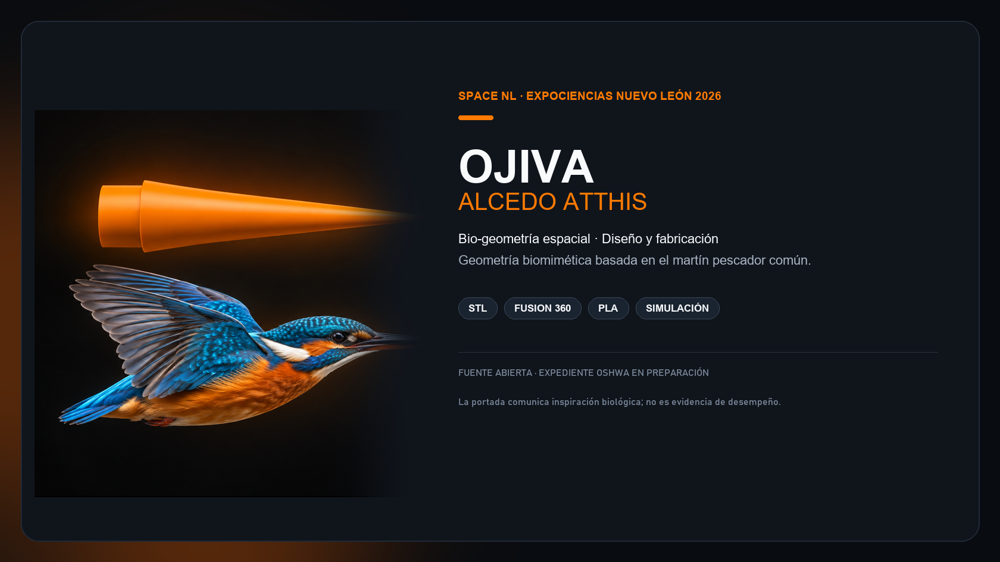

  

<h1 align="center">Bio-geometria espacial</h1>

<strong>Design and fabrication of the Alcedo atthis nose cone</strong>

  
  

Open hardware research project by SpaceNL for a biomimetic experimental-rocketry nose cone inspired by the streamlined beak morphology of the common kingfisher (*Alcedo atthis*).

> **Research prototype v1.0.** The project is prepared for OSHWA self-certification, but is **not certified** and has no OSHWA UID. Do not use the OSHWA certification mark unless and until an official UID is issued.

## Explore the project

| Area | Contents | Start here |
| --- | --- | --- |
| CAD and fabrication | Native Fusion 360 source plus printable STL | [`cad/`](cad/) |
| Manufacturing | BOM, print controls, fit and safety notes | [`docs/manufacturing/`](docs/manufacturing/) |
| Structural evidence | Fusion 360 screenshots with interpretation limits | [`docs/simulation/`](docs/simulation/) |
| Research record | Editable DOCX and reference PDF | [`docs/research/`](docs/research/) |
| Open-hardware record | Licensing, checklist and release information | [`docs/oshwa/`](docs/oshwa/) |

## Version snapshot

- Biomimetic nose cone geometry with an integrated coupling base.
- Native source: Autodesk Fusion 360 (`.f3d`).
- Manufacturing mesh: binary STL with 12,948 triangles.
- Measured STL envelope: approximately 50.47 x 52.10 x 200.00 mm.
- Documented prototype material: PLA, using 1.75 mm filament.
- Published, immutable Git revision: [`v1.1.3`](https://github.com/aurelioasu/bio-geometria-espacial-ojiva-alcedo-atthis-spacenl/tree/v1.1.3).

> **Configuration control.** The source report describes a 134.5 mm-long prototype with a 50.2 mm base, whereas the published STL has a 200 mm envelope length. This is unresolved. Confirm the intended CAD revision and units in Fusion 360 or the slicer before fabrication, testing, or certification.

## What this does and does not validate

The research records preliminary structural results and geometric continuity. It does not provide a reproducible, quantitative drag-coefficient comparison, CFD case, wind-tunnel measurement, or instrumented flight dataset that supports a performance claim relative to a conventional nose cone. Read [the preliminary-results note](docs/simulation/RESULTADOS_PRELIMINARES.md) before reusing any performance statement.

This is an experimental research component, not a flight-certified part or a propulsion guide. Any integration, testing, and operation must follow applicable rules and be reviewed for full-vehicle stability, recovery, retention and safety.

## Build from source

1. Inspect [`ojiva-alcedo-atthis-v1.f3d`](cad/native/ojiva-alcedo-atthis-v1.f3d) and confirm revision and units.
2. Import the [STL](cad/mesh/ojiva-alcedo-atthis-v1.stl) in millimetres; measure length and base diameter before printing.
3. Follow the [manufacturing guide](docs/manufacturing/BUILD.md) and record the print configuration.
4. Publish modified designs with their editable source and validation evidence.

## Licensing and attribution

- Hardware and design files: [CERN-OHL-W-2.0](LICENSES_CERN-OHL-W-2.0.txt).
- Original documentation and media: [CC-BY-SA-4.0](LICENSES_CC-BY-SA-4.0.txt).
- Scope by folder and branding exclusions: [LICENSE.md](LICENSE.md).

Original research: Suri Paola Frausto Galindo and America Aidee Segovia Martinez. Reported advisor: Fernando Alonso Villalobos. Open documentation: SpaceNL.

## Contributing

Contributions must preserve the editable source, version traceability, reproducible instructions and verifiable results. See [CONTRIBUTING.md](CONTRIBUTING.md).
